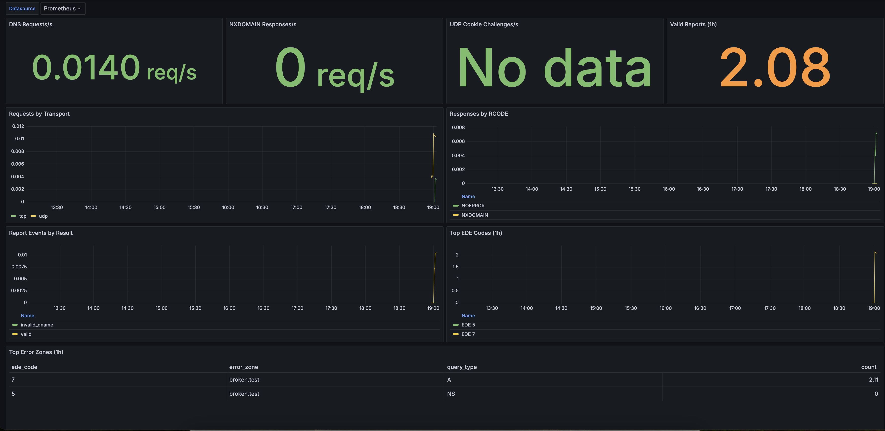

# RFC9567 Monitoring Agent (Go)

This project provides a Go daemon that acts as an RFC9567 monitoring agent.

It listens for report queries of the form:

`_er.<qtype>.<failing-qname>.<ede>._er.<agent-domain>`

and returns a positive `TXT` response for accepted reports.

## Features

- UDP + TCP DNS listener
- Prometheus metrics endpoint
- RFC9567 report QNAME parser
- JSON log output for each valid report
- UDP-without-cookie challenge (`TC=1`) as recommended by RFC9567 Section 6.3

## Run

```bash
go mod tidy
go run ./cmd/rfc9567-agent \
  -agent-domain agent.example. \
  -udp :8053 \
  -tcp :8053 \
  -metrics-addr :9100 \
  -metrics-path /metrics \
  -metrics-zone-label-depth 2 \
  -txt ok
```

## Docker stack (Agent + Prometheus + Grafana)

This repository includes a Docker Compose stack that runs:

- the RFC9567 Go agent on DNS port `53` in-container
- Prometheus scraping the agent metrics
- Grafana with auto-provisioned datasource and dashboard

### Start

```bash
cp deploy/docker/.env.example deploy/docker/.env
docker compose \
  --env-file deploy/docker/.env \
  -f deploy/docker/docker-compose.yml \
  up --build -d
```

### Configurable host ports

- `DNS_PORT` (default `53`) maps host -> container DNS (`53/tcp` + `53/udp`)
- `GRAFANA_PORT` (default `80`) maps host -> Grafana (`3000`)

Examples:

```bash
DNS_PORT=5353 GRAFANA_PORT=3000 \
docker compose \
  --env-file deploy/docker/.env \
  -f deploy/docker/docker-compose.yml \
  up --build -d
```

Then:

- DNS agent is reachable on `127.0.0.1:${DNS_PORT}`
- Grafana is reachable at `http://127.0.0.1:${GRAFANA_PORT}`

All Docker-related files live under `deploy/docker/`.

Scrape metrics at `http://127.0.0.1:9100/metrics`.

Example Prometheus configuration:

```yaml
scrape_configs:
  - job_name: rfc9567-agent
    static_configs:
      - targets: ["127.0.0.1:9100"]
    metrics_path: /metrics
```

You can disable metrics by setting an empty address:

```bash
go run ./cmd/rfc9567-agent -metrics-addr ""
```

`dns_error_agent_reports_by_ede_total` includes labels `ede_code`, `query_type`, and `error_zone`.
`error_zone` is a bounded suffix derived from the failing QNAME (rightmost labels), controlled by `-metrics-zone-label-depth`.

#### Metrics emitted

- `dns_error_agent_dns_requests_total{transport,qtype}`
- `dns_error_agent_dns_responses_total{transport,rcode,truncated}`
- `dns_error_agent_report_events_total{result}`
- `dns_error_agent_reports_by_ede_total{ede_code,query_type,error_zone}`

#### `error_zone` examples

For a failing name `www.api.broken.test.`:

- `-metrics-zone-label-depth 1` -> `error_zone="test"`
- `-metrics-zone-label-depth 2` -> `error_zone="broken.test"`
- `-metrics-zone-label-depth 3` -> `error_zone="api.broken.test"`

Use lower values for lower cardinality, and higher values for more granularity.

### Logging verbosity

Use `-v` to increase logging detail. Repeat the flag for more verbosity.

- no `-v`: startup/shutdown and critical errors only
- `-v`: log accepted RFC9567 report events (JSON)
- `-vv`: include invalid report and UDP no-cookie challenge logs
- `-vvv`: include per-query request/response debug logs

Examples:

```bash
go run ./cmd/rfc9567-agent -v
go run ./cmd/rfc9567-agent -v -v
go run ./cmd/rfc9567-agent -vvv
```

Run tests:

```bash
go test ./...
```

## Grafana dashboard

An example dashboard is included at:

- `deploy/docker/grafana/dashboards/dns-error-agent-overview.json`

This same dashboard JSON is mounted and auto-provisioned by the Docker stack.

### Dashboard preview



To import it in Grafana:

1. Open Grafana -> Dashboards -> New -> Import.
2. Upload `deploy/docker/grafana/dashboards/dns-error-agent-overview.json`.
3. Select your Prometheus datasource when prompted.
4. Save the dashboard.

The dashboard expects the metrics exposed by this service under the `dns_error_agent_*` naming convention.

## Test with `dig`

Example report query for failed `A` (QTYPE 1) on `broken.test.` with EDE `7`:

```bash
dig @127.0.0.1 -p 8053 TXT _er.1.broken.test.7._er.agent.example. +tcp
```

If you query over UDP without DNS Cookies, the daemon responds with `TC=1` so a resolver can retry over TCP.